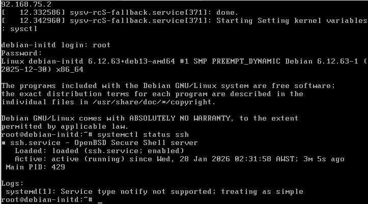
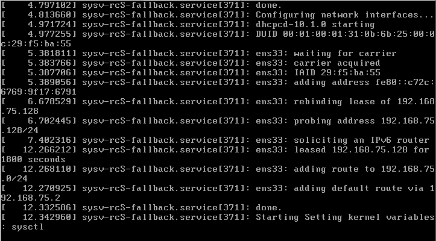
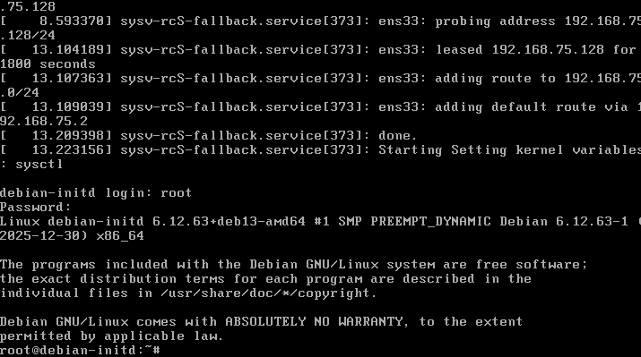
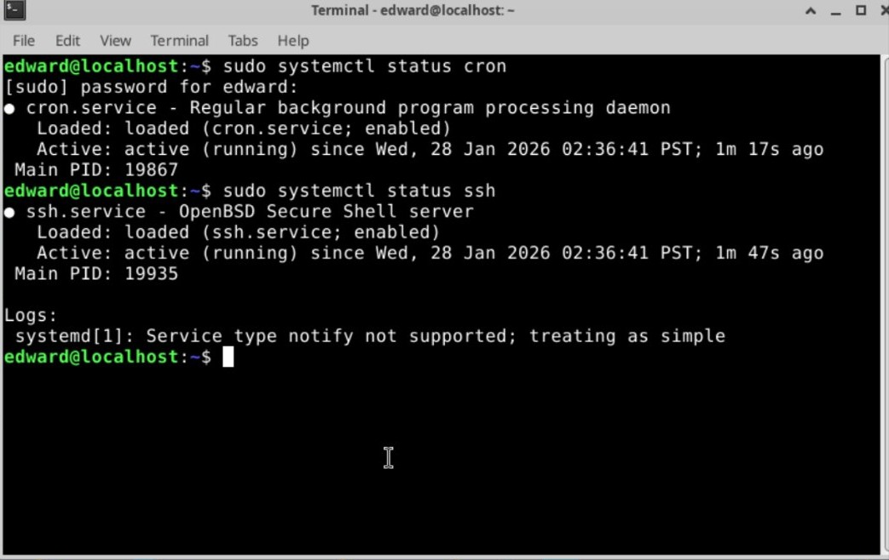
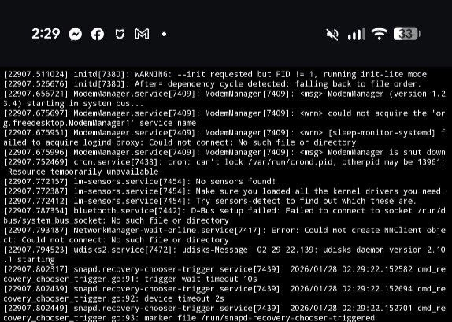
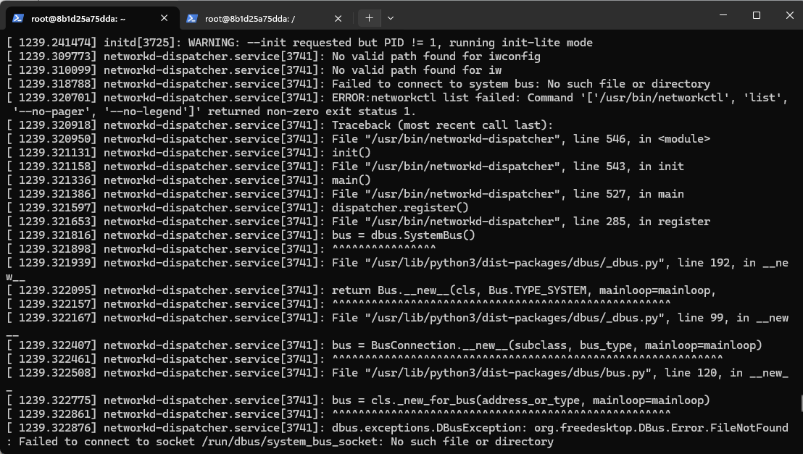
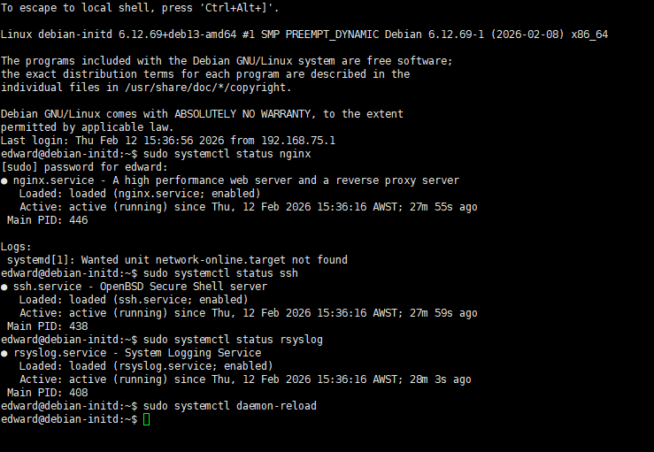

# initd

**A lightweight, systemd-compatible init system and service manager**



`initd` is a modern, lightweight init system and service manager designed as a
practical replacement for systemd in constrained, containerized, and embedded
Linux environments.

It preserves the familiar systemd service model and `systemctl` workflow,
while removing systemd’s heavy runtime dependencies and assumptions.

`initd` can run either as a standalone service manager or as a full init
process (PID 1).

---

## What is initd

`initd` is an init system and service supervisor that runs unmodified
systemd `*.service` files without requiring systemd itself.

It is designed for environments where systemd is unavailable, restricted,
or unnecessarily heavy, while still providing a clean and familiar
operational experience.

`initd` supports two primary modes of operation:

- **Service-manager mode**  
  Run as a daemon managing services, without PID 1 responsibilities.

- **Init mode (PID 1)**  
  Run as the system init process, performing essential system initialization
  and full lifecycle management.

---

## Why initd

Systemd is powerful, but it is not always suitable.

In many real-world Linux environments, systemd cannot run reliably or at all:

- Containers (Docker, unshare, rootless environments)
- Android chroot / proot
- Embedded Linux and IoT devices
- Minimal systems with limited memory or storage
- Systems that prefer a simpler, more transparent init model

In these environments, users are often forced to:

- Write ad-hoc startup scripts
- Manually launch and supervise daemons
- Give up `systemctl` entirely
- Reimplement basic init behavior

`initd` solves this by keeping the **systemd service model and operator
experience**, while removing systemd’s heavy runtime stack.

You write normal `*.service` files.  
You use familiar `systemctl` commands.  
Services behave as expected.

---

## Key Capabilities

### Full init system (PID 1)

When running as PID 1, `initd` provides core init functionality:

- Acts as the system init process
- Reaps zombie processes
- Handles init-specific signal semantics
- Remounts the root filesystem read-write
- Applies system hostname
- Spawns console login (getty or fallback shell)
- Starts all enabled services automatically
- Supports clean reboot, poweroff, and halt

This makes `initd` suitable as a real init system, not just a supervisor.

---

### Systemd-compatible service management

- Runs **unmodified systemd `*.service` files**
- Familiar `systemctl` interface
- Supports:
  - start / stop / restart
  - enable / disable
  - status / is-active / is-enabled
- Tracks:
  - service state
  - main PID
  - start/stop timestamps
  - last error
  - service logs

The goal is operational familiarity without systemd internals.

---

### System control commands

`initd` supports system-level commands via `systemctl`:

- `systemctl reboot`
- `systemctl poweroff`
- `systemctl halt`

Shutdown is performed in a controlled manner:

- New logins are disabled
- Services are stopped gracefully
- Filesystems are synchronized
- Final system action is executed

---

### Minimal and dependency-free

`initd` intentionally avoids complex subsystems:

- No systemd
- No D-Bus
- No cgroups
- No journald

Communication uses a simple Unix domain socket.
Access control relies on filesystem permissions.

The design favors clarity, auditability, and predictability.

---

## Architecture

`initd` follows a simple and explicit architecture:

- `initd` manages system and service lifecycle
- `systemctl` is a thin client communicating over a Unix socket
- No background buses or hidden dependencies
- Clear separation of responsibilities

Unlike systemd, `initd` does not attempt to be a monolithic userspace platform.


## Service Type Compatibility

initd implements the most commonly used systemd service types and provides safe fallback behavior for less frequently used types.

Supported types:

- simple
   The default service type. The service is considered started immediately after the main process is spawned.
- oneshot
   The service runs a single task and exits. The unit becomes inactive after completion.
- forking
   The service is expected to fork and write a PID file. initd waits for the PID file to appear and treats that PID as the main process.
- notify / notify-reload
   initd implements systemd-style NOTIFY_SOCKET support. The service becomes active after READY=1 is received. If READY is not received but the process remains alive, initd safely falls back to simple behavior.

Other types:

- exec
- idle
- dbus
- any unknown value

These are treated as simple for compatibility.

Rationale

The goal of initd is to provide practical compatibility with the most commonly deployed systemd units, especially in containers, embedded systems, and minimal environments.

Less frequently used service types are safely degraded to simple mode rather than causing startup failure. This ensures predictable behavior while keeping initd lightweight and dependency-free.

---

## Usage

### initd

```sh
Usage: initd [OPTIONS...]

Default behavior:
  Running initd with NO arguments defaults to init/supervisor mode (equivalent to --init).

Options:
  --init               Run as init/supervisor (autostart enabled units).
  --socket[=PATH]      Run as a pure daemon/service manager without init/PID1 behaviors.
                       If PATH omitted, defaults to /run/initd.sock.
  -h, --help           Show this help.
  -V, --version        Show version.
```

### Modes of operation

#### Init mode (recommended)

- Runs as a full init system
- Automatically starts all enabled services
- Performs essential system initialization
- Suitable for:
  - Containers
  - Chroot / proot
  - Embedded Linux
  - Minimal systems

```
initd (or initd --init)
```

#### Service-manager-only mode

- Runs without PID 1 responsibilities
- Manages services only
- Useful when integrating into existing systems

```
initd --socket
```

### systemctl

```
systemctl [OPTIONS...] COMMAND [UNIT...]

Query or send control commands to the initd system manager.

Options:
  --socket=PATH        Path to initd control socket
  -h, --help           Show this help
  -V, --version        Show version

Unit Commands:
  start UNIT...        Start (activate) one or more units
  stop UNIT...         Stop (deactivate) one or more units
  restart UNIT...      Restart one or more units
  status UNIT...       Show runtime status of one or more units
  is-active UNIT...    Check whether units are active
  is-enabled UNIT...   Check whether unit files are enabled
  enable UNIT...       Enable one or more unit files
  disable UNIT...      Disable one or more unit files
  list-units           List loaded units
  list-unit-files      List installed unit files
  daemon-reload        Reload unit files
System Commands:
  reboot               Reboot the system
  poweroff             Power off the system
  halt                 Halt the system
```

The interface is intentionally close to systemd’s `systemctl`.

## Examples

### Starting nginx

```
sudo systemctl start nginx
sudo systemctl status nginx
● nginx.service - A high performance web server and a reverse proxy server
   Loaded: loaded (nginx.service; enabled)
   Active: active (running) since Mon, 26 Jan 2026 22:57:51 PST
 Main PID: 12717
```

------

### SSH service

```
sudo systemctl daemon-reload
sudo systemctl status ssh
edward@debian-initd:~$ sudo systemctl status ssh
● ssh.service - OpenBSD Secure Shell server
   Loaded: loaded (ssh.service; enabled)
   Active: active (running) since Thu, 12 Feb 2026 15:36:16 AWST; 27m 59s ago
 Main PID: 438
```

------

### Listing units

```
systemctl list-units
UNIT                                    LOAD    ACTIVE    DESCRIPTION
nginx.service                           loaded  active    A high performance web server
ssh.service                             loaded  active    OpenBSD Secure Shell server
systemd-journald.service                loaded  inactive  Journal Service
```

------

## When to Use initd

`initd` is recommended when:

- systemd cannot run or is restricted
- systemd is too heavy for the environment
- You want systemd-style service management without systemd
- You need a real init system with minimal overhead

It is especially useful for:

- Docker containers
- Android chroot / proot
- Embedded Linux and IoT devices
- Minimal or custom Linux systems

------

## Important Notes

- Do **not** run `initd --init` alongside systemd
   Running two init systems simultaneously will cause conflicts.
- On systems where systemd is already active, only one init system
   should manage services at a time.

------

## Build

### Requirements

- Go (recent version)

### Build commands

```
make build
```

------

## Installation

Recommended installation path:

```
/usr/local/bin
```

This avoids conflicts with system-provided systemd binaries on
 Debian and Ubuntu systems.

After installation, verify that `systemctl` refers to the initd version.

------

## Recommended Startup on Bare Metal / VM (PID 1)

For full init functionality, `initd` can be used as the system init (PID 1).

### Option 1: Boot directly as init (recommended)

The most robust way is to let the Linux kernel start `initd` as PID 1 using the `init=` kernel parameter.

#### Temporary (GRUB menu, one-time test)

At the GRUB menu:

1. Select your boot entry
2. Press `e`
3. Append the following to the `linux` line:

```
init=/usr/local/bin/initd
```

1. Boot with `Ctrl+X` or `F10`

This is the safest way to test `initd` as PID 1 without modifying the system permanently.

------

#### Permanent (GRUB configuration)

Edit `/etc/default/grub`:

```
GRUB_CMDLINE_LINUX="init=/usr/local/bin/initd"
```

Then regenerate GRUB:

```
grub-mkconfig -o /boot/grub/grub.cfg
```

or on Debian/Ubuntu:

```
update-grub
```

After reboot, `initd` will be started directly by the kernel as PID 1.

------

### Option 2: Replace `/sbin/init` (not recommended)

It is technically possible to replace the system init binary:

```
ln -sf /usr/local/bin/initd /sbin/init
```

However, this approach is **not recommended**:

- Package managers may overwrite `/sbin/init`
- Recovery becomes harder if boot fails
- Harder to revert without rescue media

Using `init=` via kernel parameters is cleaner, reversible, and distribution-agnostic.

------

## Recommended Startup for Containers / Docker / Chroot / Proot

In containerized or chroot environments where PID 1 is not available, run `initd` in **init-lite mode**:

```
/usr/local/bin/initd
# or explicitly
/usr/local/bin/initd --init
```

In this mode:

- No PID 1 assumptions are made
- All enabled systemd-style services are started
- Signal handling and service supervision still work
- Suitable for Docker, chroot, Android, WSL, and embedded environments

------

## Notes

- `initd` automatically detects whether it is running as PID 1
- `--init` on non-PID 1 systems enters *init-lite mode*
- No systemd binary or PID 1 privileges are required for service management

## Images

Booting on debian:






On Android Chroot:




On Docker:





------

## License

MIT License
